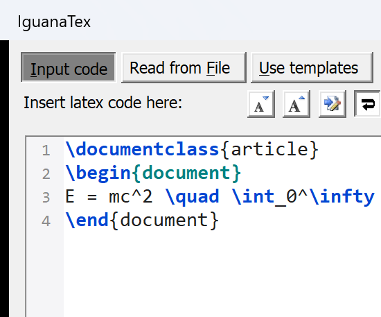

# IguanaTex (Scintilla Windows Edition)

[](https://github.com/Jonathan-LeRoux/IguanaTex)
[](https://github.com/photonzq/IguanaTex)
[](https://www.scintilla.org/)

> [!IMPORTANT]
> **Windows-Only Fork — macOS Abandoned**  
> This fork is **strictly dedicated to Windows** and **completely abandons macOS support**. All Mac-specific components (`AppleScript/`, `IguanaTexHelper/`, `libIguanaTexHelper.dylib`, and Mac-specific VBA code paths) are deprecated in this fork.  
> If you are on macOS, please use the original upstream repository at **[Jonathan-LeRoux/IguanaTex](https://github.com/Jonathan-LeRoux/IguanaTex)**.

---

## Overview

**IguanaTex** is a popular PowerPoint add-in that lets you insert and edit LaTeX equations directly inside presentations.

While the original add-in uses a plain Microsoft Forms `TextBox` on Windows, **this fork replaces the editor with a fully featured Win32 Scintilla 5 editor** backed by **Lexilla**, complete with syntax highlighting, line numbers, bracket matching, and a dedicated LaTeX snippet & environment toolbar.



---

## Table of Contents

- [Editor Enhancements (Windows)](#editor-enhancements-windows)
  - [1. Scintilla 5 + Lexilla Engine](#1-scintilla-5--lexilla-engine)
  - [2. Full LaTeX Syntax Highlighting](#2-full-latex-syntax-highlighting)
  - [3. Line Numbers & Caret Enhancements](#3-line-numbers--caret-enhancements)
  - [4. Interactive Bracket Matching](#4-interactive-bracket-matching)
  - [5. Word Wrap & Scrolling Ergonomics](#5-word-wrap--scrolling-ergonomics)
  - [6. LaTeX Snippet & Environment Toolbar](#6-latex-snippet--environment-toolbar)
- [Build Requirements & Process](#build-requirements--process)
  - [Prerequisites](#prerequisites)
  - [Repository Layout](#repository-layout)
  - [How the Build Process Works](#how-the-build-process-works)
  - [Running the Build](#running-the-build)
  - [Loading the Add-In in PowerPoint](#loading-the-add-in-in-powerpoint)
- [LaTeX & System Requirements (Windows)](#latex--system-requirements-windows)
- [License & Credits](#license--credits)

---

## Editor Enhancements (Windows)

### 1. Scintilla 5 + Lexilla Engine
- Replaces the legacy MSForms `TextBox` with a native Win32 **Scintilla 5.5.x** control host (`Scintilla.dll`) powered by **Lexilla** (`Lexilla.dll`).
- Full support for both **32-bit (x86)** and **64-bit (x64)** Microsoft PowerPoint installations.
- Text is transparently handled using UTF-8 internally, preserving full character fidelity.

### 2. Full LaTeX Syntax Highlighting
Powered by Lexilla's LaTeX lexer and custom-tuned color schemes:
- **Commands**: `\documentclass`, `\begin`, `\end`, `\frac`, `\sqrt`, `\int`, `\alpha`, etc. in **bold blue** (`RGB(0, 70, 210)`).
- **Environments**: `{equation}`, `{align*}`, `{document}`, etc. both after `\begin` (`SCE_L_TAG`) and `\end` (`SCE_L_TAG2`) in **bold dark cyan** (`RGB(0, 130, 130)`).
- **Inline Math**: `$...$` in **dark green** (`RGB(20, 128, 20)`).
- **Display Math**: `$$...$$`, `\[...\]` in **bold forest green** (`RGB(0, 110, 0)`).
- **Command Options**: Optional parameters like `[12pt]`, `[h!]` in **dark golden orange** (`RGB(160, 80, 0)`).
- **Comments**: `% ...` in **italic slate gray** (`RGB(120, 130, 140)`).
- **Special Symbols**: `&`, `^`, `_`, `~` in **crimson** (`RGB(180, 30, 30)`).
- **Verbatim Text**: In **warm brown** (`RGB(130, 65, 10)`).
- **Instant Colourisation**: Invokes `SCI_COLOURISE` on document loads so text is styled immediately.

### 3. Line Numbers & Caret Enhancements
- Dedicated line-number margin (Margin 0) styled with Consolas font and subtle separator gutter.
- Subtle background highlighting on the active caret line (`RGB(246, 248, 254)`).
- 2px wide blinking caret for high visibility.

### 4. Interactive Bracket Matching
- Automatic bracket pair detection via Win32 timer:
  - Matching pairs of `{ }`, `( )`, and `[ ]` are highlighted with a soft blue backdrop (`RGB(190, 225, 255)`).
  - Unmatched or orphaned brackets are highlighted in soft red (`RGB(255, 200, 200)`).

### 5. Word Wrap & Scrolling Ergonomics
- Word wrap defaults to **OFF**, allowing natural horizontal scrolling, fixed line indentation, and standard Enter key newline behaviors.
- One-click toggle button on the editor header allows switching word wrap on/off on the fly.
- Horizontal and vertical Win32 scrollbars are fully supported.

### 6. LaTeX Snippet & Environment Toolbar
Directly above the editor sits an ergonomic snippet toolbar:
- **One-Click Insert Buttons**:
  - `[eq*]` : Inserts `\begin{equation*}` ... `\end{equation*}` block.
  - `[align*]` : Inserts `\begin{align*}` ... `\end{align*}` block.
  - `[a/b]` : Inserts `\frac{}{}` (places caret in numerator, or wraps selected text).
  - `[√]` : Inserts `\sqrt{}`.
  - `[text]` : Inserts `\text{}`.
  - `[$]` : Inserts inline math delimiters `$...$`.
  - `[$$]` : Inserts display math block `$$...$$`.
  - `[( )]` : Wraps selection or inserts parentheses `()`.
  - `[{ }]` : Wraps selection or inserts curly braces `{}`.
- **`Ω Symbols ▾` Dropdown**:
  - Greek letters (lowercase and uppercase: `\alpha` through `\Omega`).
  - Calculus & operators: `\int`, `\iint`, `\oint`, `\sum`, `\prod`, `\partial`, `\nabla`, `\infty`, `\lim`, `\sup`, `\inf`, `\max`, `\min`.
  - Relations & logic: `\leq`, `\geq`, `\neq`, `\approx`, `\equiv`, `\pm`, `\times`, `\in`, `\subset`, `\cup`, `\cap`, `\forall`, `\exists`, arrows.
  - Math fonts: `\mathbf`, `\mathcal`, `\mathbb`, `\mathrm`, `\bm`.
- **`{ } Envs ▾` Dropdown**:
  - Quick insertion of environments: `equation*`, `equation`, `align*`, `align`, `aligned`, `gather*`, `gather`, `multline*`, `multline`, `cases`, `pmatrix`, `bmatrix`, `vmatrix`, `matrix`, `array`, `tabular`, `itemize`, `enumerate`.
- **Smart Selection Wrapping**:
  - If text is highlighted in the editor, clicking a snippet button or choosing an environment wraps the selected text directly.
  - If no text is selected, a pre-formatted multi-line skeleton with alignment points (`&`, `\\`) is inserted and the caret is positioned inside.

---

## Build Requirements & Process

Because PowerPoint add-ins (`.ppam`) are binary zip containers with an embedded compiled VBA storage stream (`ppt/vbaProject.bin`), updating VBA source files in Git requires compiling and re-packaging. This repository includes an automated build pipeline ([`build.py`](build.py)) to handle this in one command.

### Prerequisites

1. **Operating System**: Windows 10 or Windows 11.
2. **Microsoft PowerPoint**: Installed on your system (Office 365, PowerPoint 2016, 2019, or 2021; either 32-bit or 64-bit).
3. **Python 3.10+**: (e.g. Anaconda base Python or standard python.org installation).
4. **Python Dependencies**:
   ```powershell
   pip install pywin32 pillow
   ```
5. **PowerPoint Trust Center Settings**:
   - Open PowerPoint > **File** > **Options** > **Trust Center** > **Trust Center Settings...**.
   - Under **Macro Settings**, check:
     - **Trust access to the VBA project object model** (required so Python COM automation can update and compile VBA modules).

### Repository Layout

```text
IguanaTex/
├── LatexForm.frm            # Main editor UserForm code (snippet toolbar & Scintilla container)
├── LatexForm.frx            # UserForm binary resource (control properties & icons)
├── TextWindow.cls           # Scintilla wrapper class (Win32 creation, sizing, UTF-8 text)
├── TextWindowFont.cls       # Scintilla font size and styling wrapper
├── ScintillaConstants.bas   # Win32 API declarations, Scintilla messages, lexer styles, timers
├── Macros.bas               # Add-in entry points and ribbon action handlers
├── Defaults.bas             # Default paths and LaTeX templates
├── build.py                 # Automated sync, compile, and deploy pipeline
├── lib/
│   ├── x86/                 # 32-bit Scintilla.dll & Lexilla.dll (for 32-bit Office)
│   └── x64/                 # 64-bit Scintilla.dll & Lexilla.dll (for 64-bit Office)
└── scintilla_editor_preview.png
```

### How the Build Process Works

When you run [`build.py`](build.py), the script performs the following 5 automated steps:

```
[1/5] Ingest Source Code
      └── Reads ScintillaConstants.bas, TextWindow.cls, LatexForm.frm, Macros.bas.
          Strips attribute headers and injects clean code modules into IguanaTex_Debug.pptm.

[2/5] In-Process VBE Compilation
      └── Invokes the PowerPoint Visual Basic Editor compile command (ID 578) via COM.
          Verifies 0 syntax errors, 0 ambiguous names, and 0 type mismatches.

[3/5] Extract vbaProject.bin
      └── Extracts the compiled ppt/vbaProject.bin binary stream from the PPTM zip archive.

[4/5] Package & Inject
      └── Injects the compiled binary stream into:
          • IguanaTex_Dev.pptm (for local development/debugging)
          • IguanaTex_Scintilla.ppam (the add-in package)
          • %APPDATA%\Microsoft\AddIns\IguanaTex_Scintilla.ppam (installed add-in)

[5/5] Deploy DLLs
      └── Copies lib\ (x86 and x64 Scintilla.dll / Lexilla.dll) alongside the .ppam
          in %APPDATA%\Microsoft\AddIns\lib\ so PowerPoint loads the matching architecture.
```

### Running the Build

Run the build script from PowerShell or Command Prompt:

```powershell
# Using Anaconda Python:
& "C:\ProgramData\anaconda3\python.exe" build.py

# Or using standard Python:
python build.py
```

Expected output:
```text
============================================================
  IguanaTex Scintilla Build & Deployment
============================================================

[1/5] Updating Master PPTM VBA components...
  -> Updating ScintillaConstants...
  -> Updating TextWindow...
  -> Updating LatexForm...
  -> Updating Macros...

[2/5] Compiling VBA project via VBE CommandBar (ID 578)...
  -> VBE Compile executed cleanly (0 syntax/type errors).
  -> Master PPTM saved.

[3/5] Extracting compiled vbaProject.bin...

[4/5] Injecting into Add-In packages (.ppam)...
  -> Updated C:\Users\zqiu\Desktop\IguanaTex_Scintilla\IguanaTex_Dev.pptm
  -> Updated C:\Users\zqiu\Desktop\IguanaTex_Scintilla\IguanaTex_Scintilla.ppam
  -> Deployed to C:\Users\zqiu\AppData\Roaming\Microsoft\AddIns\IguanaTex_Scintilla.ppam

[5/5] Syncing Scintilla and Lexilla DLLs...
  -> Synced DLLs to C:\Users\zqiu\Desktop\IguanaTex_Scintilla\lib
  -> Synced DLLs to C:\Users\zqiu\AppData\Roaming\Microsoft\AddIns\lib

============================================================
  BUILD COMPLETE: All targets successfully updated!
============================================================
```

### Loading the Add-In in PowerPoint

1. If PowerPoint was already running, **close and reopen PowerPoint** so that PowerPoint reloads the `.ppam` from disk.
2. In PowerPoint, navigate to:
   **File** > **Options** > **Add-Ins**.
3. In the **Manage** dropdown at the bottom, select **PowerPoint Add-ins** and click **Go...**.
4. Check **IguanaTex_Scintilla** (or click **Add New...**, browse to `%APPDATA%\Microsoft\AddIns\IguanaTex_Scintilla.ppam`, and click **Open**).
5. Open any presentation and click **New LaTeX Equation** from the **IguanaTex** tab in the ribbon.

---

## LaTeX & System Requirements (Windows)

To compile and render LaTeX equations into images or SVG shapes, you need:

1. **LaTeX Distribution**: [TeX Live](https://www.tug.org/texlive/) or [MiKTeX](https://miktex.org/).
2. **Ghostscript**: [Ghostscript for Windows](https://www.ghostscript.com/download/gsdnld.html) (e.g. `gswin32c.exe` or `gswin64c.exe`).
3. **ImageMagick**: [ImageMagick for Windows](https://imagemagick.org/script/download.php#windows) (`magick.exe`).
4. **(Optional for EMF vector output)**: [TeX2img](https://github.com/abenori/TeX2img) (`TeX2imgc.exe`).
5. **Configuration**:
   - In PowerPoint, click **Main Settings** on the IguanaTex ribbon.
   - Set the paths to your Ghostscript executable (`gswin64c.exe` or `gswin32c.exe`), ImageMagick (`magick.exe`), and your preferred temp folder (e.g., `C:\Temp\`).

---

## License & Credits

- Original IguanaTex: (C) [Jonathan Le Roux](https://www.jonathanleroux.org/) and Zvika Ben-Haim.
- Scintilla Windows Edition enhancements: Developed by [photonzq](https://github.com/photonzq) with Gemini (Antigravity).
- Scintilla is (C) Neil Hodgson and contributors (HPND License).
- Lexilla is (C) Neil Hodgson and contributors (HPND License).
- Licensed under the [Creative Commons Attribution 3.0 Unported License](http://creativecommons.org/licenses/by/3.0/).
